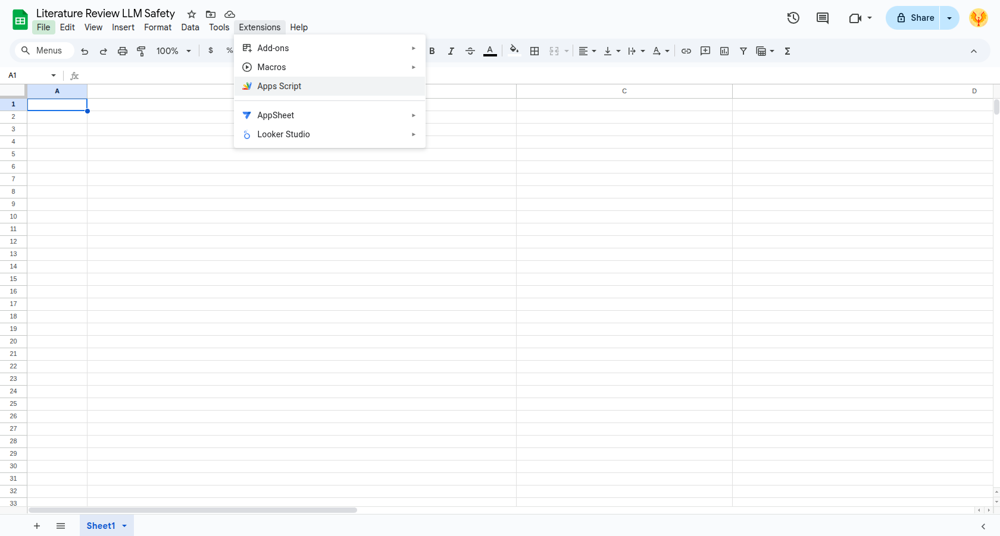
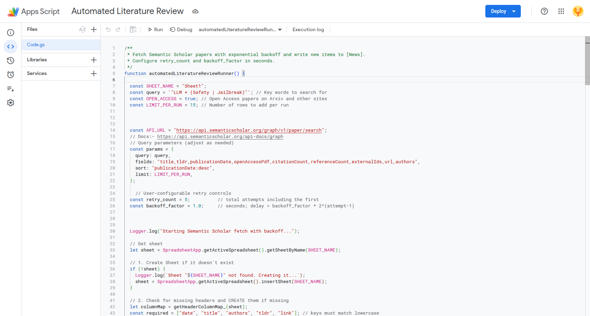
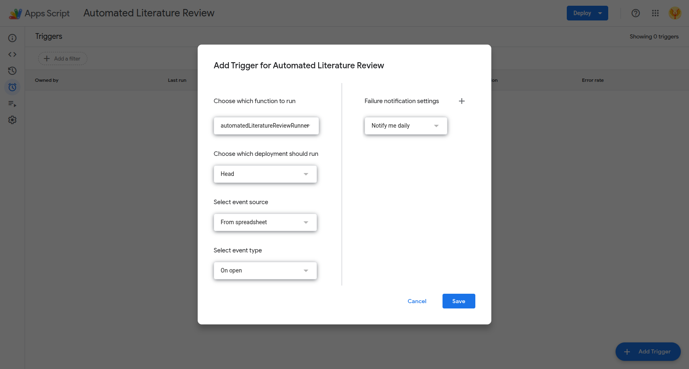
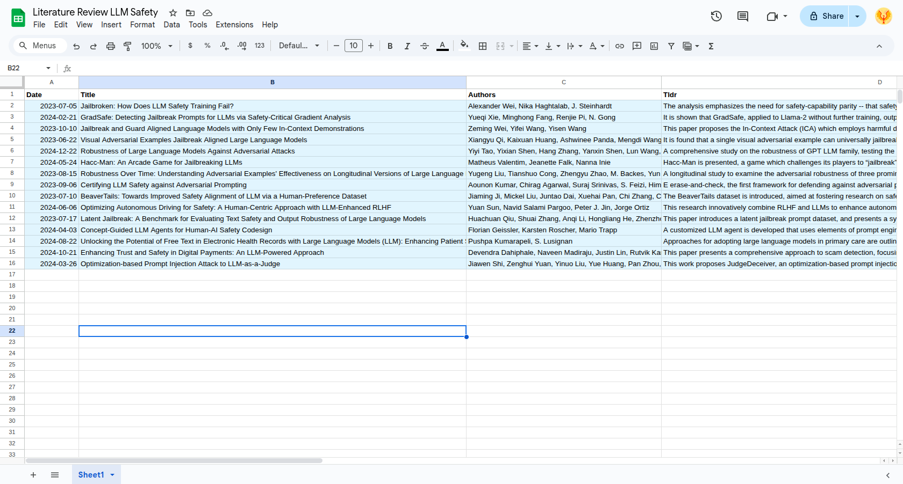

# Automated Literature Review Fetching using Google Sheets
Automation of academic literature review by fetching the relevant papers from Semantic Scholar using Google App Scripts in Google Sheets. This script helps in fetching the latest papers related to a keyword. 

# Instructions

Lets setup an automated literature review for the topic of LLM Safety

### Step 1
Create a new Google Sheet where the research papers are to be listed



### Step 2
Setup the Google App Scripts by navigating from the Google Sheet top Menu Extension -> App Script. Paste the script from this repo. 


### Step 3
Modify the `SEARCH_KEYWORD` variable in the script to your topic of interest. For example: 
```javascript
  // Simple Default Match
  // Matches papers that contain the terms "LLM" and "safety" anywhere in the text (default AND behavior).
  const SEARCH_KEYWORD = 'LLM Safety';

```

Modify other parameters that you feel comfortable with. Save the script.



A more complex query can be:
```javascript

  // Example with Exact Phrase OR Logic
  // Matches papers containing the exact phrase "LLM safety" OR the exact phrase "AI alignment".
  const query2 = '"LLM safety" | "AI alignment"';

  // Example with Prefix Matching, Precedence, and Negation
  // Matches papers containing the exact phrase "LLM safety" AND terms starting with "toxic" (e.g., toxicity, toxic), 
  // but excludes papers containing the word "reinforcement".
  const query3 = '"LLM safety" + (toxic*) -reinforcement';

  // Example with Proximity Search with Fuzziness
  // Matches papers where "LLM" and "safety" appear within 5 words of each other (e.g., "safety issues in LLM"), 
  // AND contains a fuzzy match for "attack" (matches "attack", "attacks", "attak").
  const query4 = '"LLM safety"~5 + attack~';

  // Example with Complex Combination (Nested Groups, Phrase Proximity, Prefix, and Negation)
  // Matches papers that:
  // 1. Contain "LLM" and "safety" within 3 words OR the exact phrase "large language model security".
  // 2. AND contain terms starting with "jailbreak" OR "inject" (e.g., injection).
  // 3. AND strictly exclude the term "image" (to focus on text-only modalities).
  const query5 = '("LLM safety"~3 | "large language model security") + (jailbreak* | inject*) -image';

```


### Step 4
Setup a time based trigger to run the script periodically. In the App Script Editor, navigate to Triggers (clock icon on left sidebar) -> Add Trigger (bottom right corner) -> Select `automatedLiteratureReviewRunner` function, select "Time-driven" event source, and choose your desired frequency (I prefer to trigger the script each time I open the Google Sheet, So that I actually read the papers and the list dont just pile up).




### Step 5
Thats it! You are all setup. You can also run the script manually from the App Script Editor by clicking the Run button (play icon). The script will fetch the latest papers related to your topic and append them to the Google Sheet. Now its your turn to read the papers and take notes!



## Tips to get more papers from the script
- Increase the `LIMIT_PER_RUN` variable in the script to fetch more papers per run.
- Modify the `SEARCH_KEYWORD` variable to a broader topic to get more papers.
- Modify `OPEN_ACCESS` filter to false in the script to get papers from all sources (but some papers may be behind paywalls).
- Increase the `PUBLISHED_PAST_MONTHS` variable to fetch papers from a longer time frame.


## Note
- The Semantic Scholar API has rate limits. If you plan to run the script frequently, consider applying for a API Key.
- Greatful to [Semantic Scholar](https://www.semanticscholar.org/) for providing free access to their API for academic research. 
[[ Kinney, Rodney Michael et al. “The Semantic Scholar Open Data Platform.” ArXiv abs/2301.10140 (2023): n. pag. ]]
- Greatful to Gemini and ChatGPT for helping me write the script.
